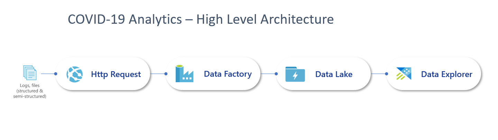
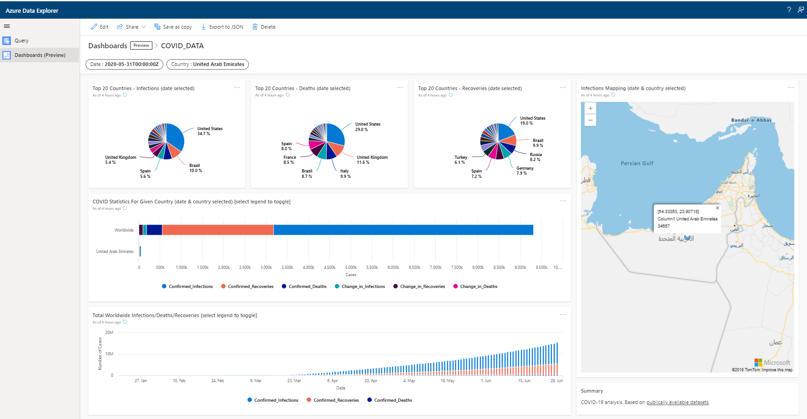

About this workshop 
====================
Welcome to this Azure cloud-scale Analytics workshop(s)! The workshop is entitled "COVID-19 - Analytics in Minutes" and, in it, you will build a working architecture solution to perform the following:

  - connect to a publically hosted COVID-19 datasource
  - ingest a dataset to a [date parameterised] staging area on Azure Data Lake (ADLS)
  - ingest this ADLS dataset to ADX
  - write KQL queries to query the data residing in the ADX datastore
  - build a dashboard visualisation for analysis of the ADX datastore
  
The solution will be built using hands-on step-by-step guided activities. This workshop is intended to be taken self-paced or via an
instructor-led event.

This workshop is designed for data professionals who have a basic
working knowledge of Microsoft Azure, Analytics and Cloud computing. It
is designed around the Azure portal to allow uptake by all Azure users
regardless of their skills with (for example)  PowerShell, CLI, etc.

This **README.MD** file explains how the workshop is structured, what
you will learn, and the technologies you will use in this solution.

Introduction
============
Simplistically, [Azure Data Explorer
(ADX)](https://azure.microsoft.com/en-us/services/data-explorer/) is a 
scalable cloud service for running interactive analytics over
Big Data. ADX is a fast, fully managed data analytics service for real-time
analysis on large volumes of either streaming data (e.g. websites and IoT
devices) or batch data (data at rest). You can deploy ADX to collect,
store, and analyse data for the purpose of identifying patterns,
anomalies, enhance customer experiences, monitor devices, and boost
operational performance.

The nature of ADX permits "what if" data wrangling over all data presented. 
Additionally, it has the ability to visualise such analytics without the need for additional tooling, or investment, with built-in visualisations and the [ADX Dashboard] (https://docs.microsoft.com/en-us/azure/data-explorer/azure-data-explorer-dashboards)

Purpose
=======
The main purpose of this workshop is to, firstly, help educate and build awareness
around Azure data services and the ease of building cloud based, scalable, architectures. Secondly, these architectures will have re-usable artefacts that can:

-   be utilised to quickly deploy a set of Azure services that utilise
    ADF, ADLS and/or ADX within your subscription, and,

-   help educate how ADF, ADLS and ADX can be deployed within architectural scenarios
    to address analytical use cases for data whether the data is at
    batch or streaming.

Content
=======
The workshop has been designed to enable you to work through each section
in a step by step basis with the view to producing a working solution
architecture at the end.

Each workshop will have a high-level architectural diagram that will be
identified at the start and has been written in a graphical click-by-click style to encourage familiarity
with the Azure Portal resulting in ease of deployment and adoption.  

Background Reading
==================
The following links will help with the understanding of ADX and Cloud
based architectures.

For an in depth look that the ADX product, the
[whitepaper](https://azure.microsoft.com/en-us/resources/azure-data-explorer/)
can be referenced.

James Serra has a great blog and this
[article](https://www.jamesserra.com/archive/2019/03/azure-data-explorer/)
provides an excellent high level summary of ADX.

To understand
[KQL](https://docs.microsoft.com/en-us/sharepoint/dev/general-development/keyword-query-language-kql-syntax-reference),
the query language used in ADX, this [Pluralsight
course](https://www.pluralsight.com/courses/kusto-query-language-kql-from-scratch)
is an excellent facilitator.

Core Azure Services
===================
In this workshop the following Azure services will be deployed. 

[Azure Data Lake (ADLS)](https://docs.microsoft.com/en-us/azure/storage/blobs/data-lake-storage-introduction)

[Azure Data Explorer (ADX)](https://azure.microsoft.com/en-gb/services/data-explorer/)

[Azure Data Factory (ADF)](https://azure.microsoft.com/en-us/services/data-factory/)

Subscription
============
You will need an Azure subscription into which the services identified
in a lab can be created.

> **Option 1** - Microsoft Developer Network Account (MSDN) Account
>
> The best way to take this workshop is to use your Microsoft Developer
> Network (MSDN) benefits if you have a subscription.
>
> Open this resource and click the \"Activate your monthly Azure
> credit\" button. If you don\'t have an Azure subscription, create a
> [free Azure account](https://azure.microsoft.com/free/) before you
> begin.
>
> **Option 2** - Use Your Own Account
>
> You can also use your own account or one provided to you by your
> organization, but you must be able to create a resource group and
> create, start, and manage a the Azure services as mentioned in 'Core
> Azure Services' above.

Workshop(s)
===========
The first workshop, "Workshop 1", is intended to produce a data pipeline that ingests a publically available COVID-19 dataset, via ADF, to ADLS. 
This dataset is then loaded into ADX by fully replacing the existing
dataset during each iteration.

The second workshop, "Workshop 2", will re-use the majority of artifacts from "Workshop 1" but will append new data, also referred to as deltas or updates, 
during each iteration rather than fully replacing it as with "Workshop 1".

The architecture can easily be enhanced to include additional Azure
services such as structured/relational datastores (SQL Server,
PostgreSQL) or semi-structured/non-relational datastores (e.g. Cosmos
DB).

Workshop 1: COVID-19 Analytics in Minutes (full data refresh) ** Release & available now July 2020 **
=============================================================

Workshop 1: Summary
-------------------
Ingest a COVID-19 CSV format datafile from a public server to Azure. Using ADF, land this data to ADLS and then load into ADX. Replace all data currently residing in ADX. Use KQL to perform analysis on the data and build an ADX dashboard to visualise it.

This solution architecture provides support for data ingestion for both
structured and semi-structured data. Currently CSV data is used, but JSON, JSONL and Parquet files exist on the public repositories.  

Workshop 1: Architecture
------------------------
The diagram below shows the high level architecture that will be built:

Workshop 1: ADX Dashboard Visualisation
---------------------------------------
The following ADX dashboard will be built:

Workshop 2: COVID-19 Analytics in Minutes (incrmental/delta data refresh) ** NOT Released **
=========================================================================

Workshop 2: Summary
-------------------
Ingest a COVID-19 CSV format datafile from a public server to Azure. Using ADF, land this data to ADLS and then load into ADX. Append incremental/delta updates to the data currently residing in ADX. Use KQL to perform analysis on the data and build an ADX dashboard to visualise it.

This solution architecture provides support for data ingestion for both
structured and semi-structured data. Currently CSV data is used, but JSON, JSONL and Parquest files exist on the public repositories.  

Workshop 2: Architecture
------------------------
The diagram below shows the high level architecture that will be built:

Workshop 2: ADX Dashboard Visualisation
---------------------------------------
The following ADX dashboard will be built:

